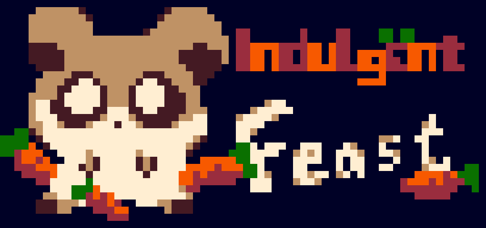
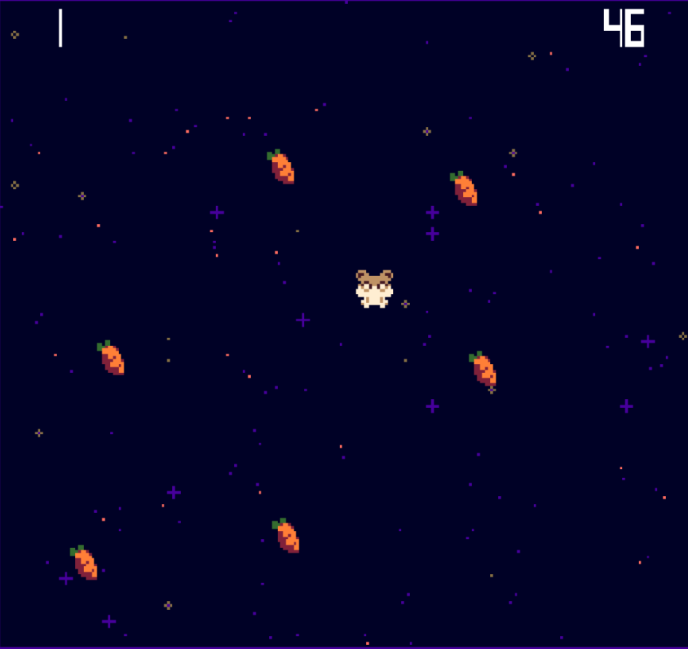

#Indulgent Feast

Author: Weiwen "Andy" Jiang

Design: A viscious hamster that rolls around hunting for timid carrots, try to get as many as possible in 60 secs!

Screen Shot:

How the Asset Pipeline Works:

Asset Pipeline starts the PNGConverter struct. The struct converts each png file into its own .tile file. It first runs through all the pngs to get all of the palettes and consolidate palette's order. Then it goes through each png, assign its palette, breaks the color information into bit0 and bit1 arrays, then store into assets folder. If the image is larger than 8x8, they are broken up into 8x8 chunks in row-major order and stored together with row and column number information. This struct is run automatically when the macro ASSET_CONVERSION is defined in the AssetController.cpp file.

The reading is done through AssetController struct. The struct loads tiles and palette through the respective functions and puts together larger than 8x8 structs into an array. The struct can also load a folder of pngs, sort their name alphabetically and load them in order into an animation struct.

For larger than 8x8 images, the draw() function in Actor struct looks at the center position of the image and calculate the actual position of each sprite. For animations, sprites are either swapped out and replaced by new tile indices controlled by the Actor struct (when a new frame needs to be drawn for the animation), or the tile is replaced completely on the tile table (for the Hamster specifically, this was done when I thought there are only 64 tiles, so I wanted to save space).

Source files are included in the "\assets\png" folder.

How To Play:

Arrow keys to move, space bar to roll (gives a huge speed boost that wears off quickly, hard to change directions once you start). Once time is up, press "r" to restart! Run over the carrots to eat them, top left is your score, top right is the time left, you will always have 60 seconds. Your score will display in the center of the screen if the time is up.

This game was built with [NEST](NEST.md).

